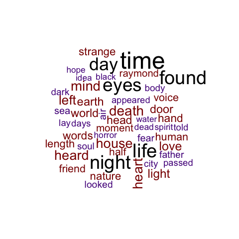
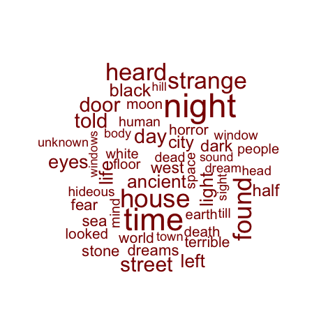
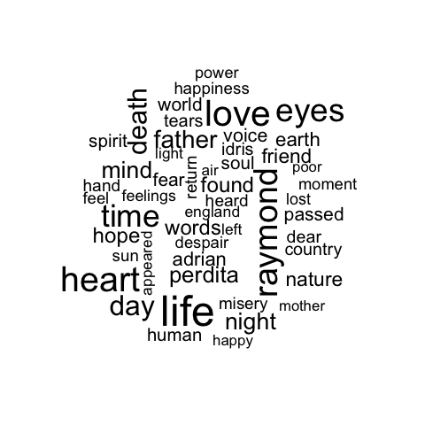
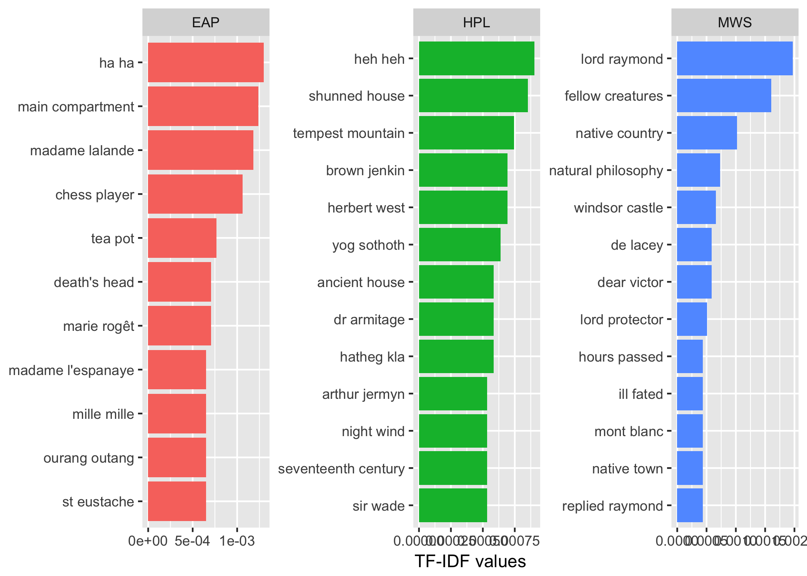
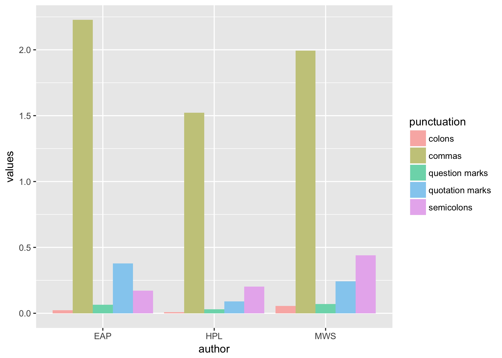

# Spring2018
# Project 1: SPOOKY Textual Analysis

----


### Project Description
This is the first and only *individual* (as opposed to *team*) this semester. 

Term: Spring 2018

+ Project title: The similarities and differences between three different spooky authors
+ This project is conducted by Minzi Keem
+ Project summary: The goal of this project is to analyze the text data of `spookydata` in new and interesting ways. More specifically, we want to look at the similarities and the differences between the authors. Here, we look at how frequently a word shows up in usage, then we take a look at how frequently a set of words uniquely show up for a respective author. We then see how many punctuation marks an author uses, and lastly, we the gendered pronouns that an author uses.
+ For reference: I will be using EAP to mean Edgar Allen Poe, HPL to mean HP Lovecraft, and MWS to mean Mary Shelley.

### Word frequency
First, let's take a look at how frequently a specific word is used in all of the texts. Here, we graphically represent the most frequent fifty words in what is called a "wordcloud". A wordcloud will represent the frequency of the word by making the size of the word larger.



We can see here that the most common words used by all the authors are "time", "found", "night", "day", "life", and "eyes". Not super surprising, given that authors talk about time, perhaps in terms of night and day, and a horror genre writer is apt to talk about death (or lack thereof, as with life). Of the most frequent words, found and eyes are the most strange. Perhaps these authors search for eyes often? Who knows. More likely, though, other things are "found", while "eyes" show how someone is feeling. After all, the eyes are supposed the window to the soul. 

Let's take a look at the wordcloud broken down by author.





Here we can see a few things:
+ EAP appears to find a lot of time? Though in all seriousness, no words particularly stick out for EAP. Many of his most common words are the same words in our all authors image, but it may be skewed because our all image doesn't account for relative frequency.
+ HPL also finds a lot of time! But interestingly enough, he does so in a "strange" "house". Interesting. We also note that many of his sentences feature the word "night" as opposed to "day", so a lot of his settings probably occur at night. 
+ MWS really loves Raymond... I have to admit, I've never read MWS, but apparently Raymond is a popular person in her works. She also "love"s "life" and has a lot of "heart". How sweet!! MWS seems to be the more unique of the authors we explore here, as a lot of the words in her wordcloud don't overlap with the words in the master wordcloud. 

Our last point about MWS is interesting, as it seems that she uses many more "unique" words than other authors. I say "unique" in the sense that other authors don't use that word very often (like raymond). We want to take a look at how often each author says something, so we use the tf-idf method. Wikipedia explains the [tf-idf](https://en.wikipedia.org/wiki/Tf%E2%80%93idf/) method as "a numerical statistic that is intended to reflect how important a word is to a document in a collection or corpus". 

We leave the analysis of tf-idf of individual words to someone else (i.e. someone with more time on their hands), because we want to look at pairs. After all, all good things come in pairs!

### Bigrams
Tidytext helps us identify what we call "bigrams", which are two adjacent words that we want to study in a group. First, let's take a look at the tf-idfs of the bigrams of all three authors.



Here we can see a few things:
+ EAP and HPL both really enjoy laughing... but as they are of the horror genre, I can't imagine that those bits of laughter are anything more than sinister. Particularly "heh heh". No good comes out of "heh heh"s. 
+ MWS really REALLY loves Raymond. Here, we learn that he is a lord! We also learn here that he replies to people a lot, as seen by the very bottom right corner. Perhaps he's a talkative sort of person, or a main character of MWS's writings. 
+ Not only does HPL make up a lot of words, but he also likes to REPEAT the words that he makes up. Not as much as he likes creepy laughter, though.
+ EAP likes to use the words "main compartment", "tea pot", and "chess player" in his texts. For HPL, we see a lot of houses, but more specifically, "shunned house"s and "ancient house"s. Besides loving Raymond, MWS also says "fellow creatures", "natural philosophy", and "ill fated" a lot.

We can also produce a network of the bigrams to see the relationships between different words. Here we use *igraph* and *ggraph* packages. The direction of the arrows tell you the order of the words, and the transparencies show the frequency -- the darker the arrow, the more often that bigram appears.


We can see through the bigram network that there are many stand-alone bigrams, such as "return home" or "natural philosophy", but there are also a few that connect to multiple words, like "human" to "race" and "nature", or "connecting" and "front" to "door". 

### Punctuation
Let's take a look at punctuation next. How often does each other use a specific punctuation mark?


Pardon me for the ugly colors of the chart. Hopefully people like pastel tones.

Before we start with analysis, we must note that the punctuations used for the sake of analyses are commas, colons, question marks, quotation marks, and semicolons. Originally, I wanted to check for hyphens and exclamation points as well, but after a cursory glance through the raw text in the data file, it appeared that there were no exclamation points or hyphens. This is interesting, because we'd expect more people to SCREAM!!! in a horror story. Alas, maybe those bits were not available for our data set. This figure also does not adjust for the number of lines in the data set corresponding to each author: EAP has 7900 sentences, HPL has 5635, and MWS has 6044. We will take a look at those averages later.

Here are some points of note: 
+ EAP uses the most punctuation, followed by MWS and HPL. Not surprising, given that we have the most data "points" (i.e. text files) for EAP, followed by MWS and HPL. 
+ MWS seems to like the use of semicolons the most, using them frequently in her text. Compound sentences must be her forte.
+ EAP uses the most quotation marks in his text. Granted, this analysis can't distinguish between dialogue and particular "air quotes" but it's safe to assume that EAP, and the other two authors doesn't use too many of those -- they probably don't appear often in fictional stories that don't include sarcasm. This point is also dependent on whether or not the quotation mark appears twice; most dialogues will include two quotation marks, though a cursory glance at the data showed that this is not always the case.
+ No one likes colons. That's okay, neither do I. 

Now let's look at averages!



This figure makes it easier to see how often a punctuation occurs in a sentence, as it's an average of how often each punctuation shows up per sentence.


Following [suggestions](http://nicercode.github.io/blog/2013-04-05-projects/) by [RICH FITZJOHN](http://nicercode.github.io/about/#Team) (@richfitz). This folder is organized as follows.

```
proj/
├── lib/
├── data/
├── doc/
├── figs/
└── output/
```

Please see each subfolder for a README file.
